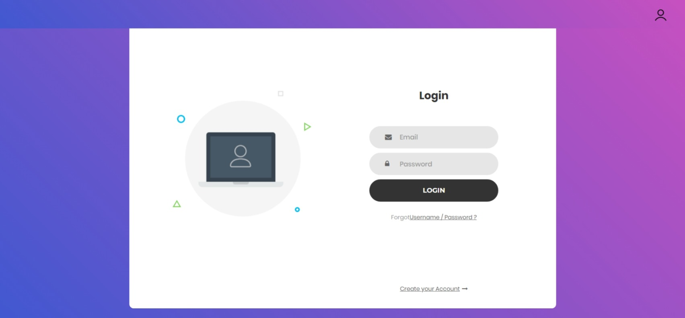
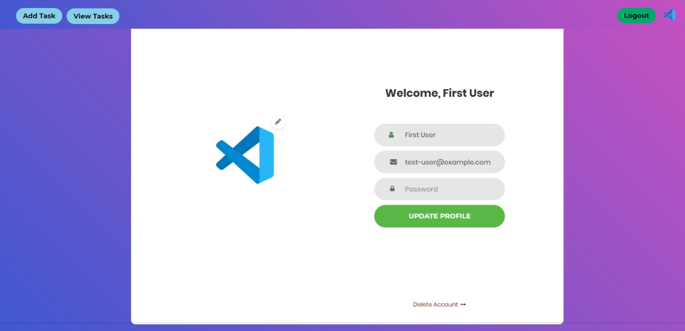
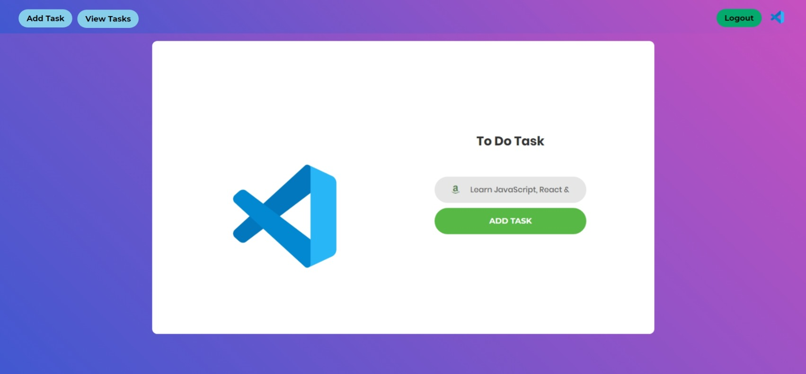
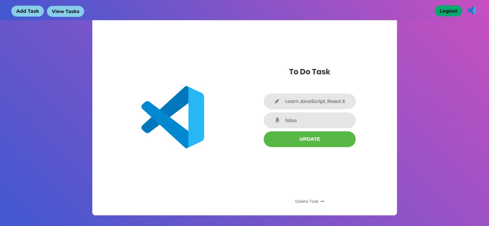

### Movie Application

Project based on **React.js**, it allows users to create tasks.

### Pre Requisites

- **Node.js** version **21** or greater.

### Dependencies used by the project

1. **react**.
2. **redux**.
3. **jest**.

### Required environment variables

1. `domainName` specify the address of the `Task Manager API` in `./src/config`.

### Available scripts

1. `npm start` for running the application in production environment.

### Instructions

1. Visit `http://localhost:3000` in the browser.

2. Home page displays a login form. 

3. Login with the credentials or create a new account if you dont have already. 

4. Click on the `Add Task` button to add a new task. 

4. Click on the `View Tasks` button to view all tasks. 
